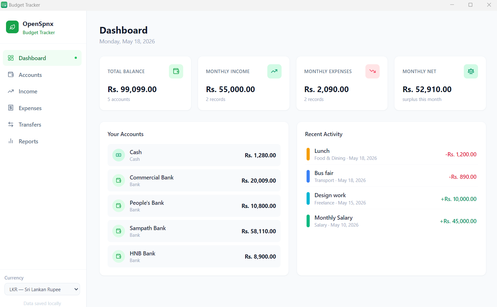
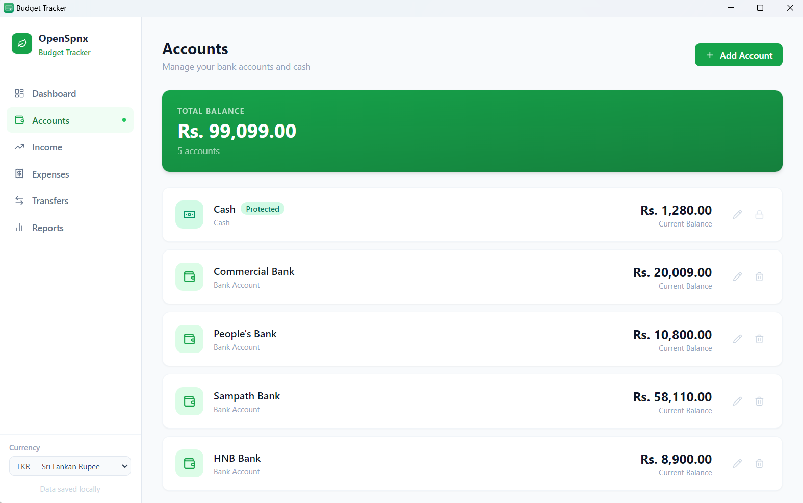
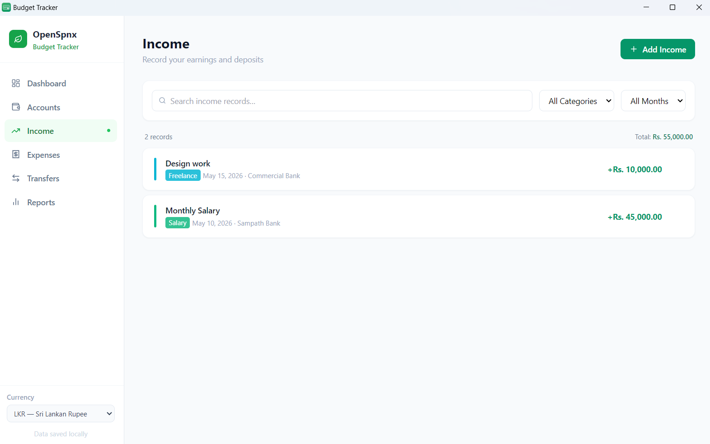
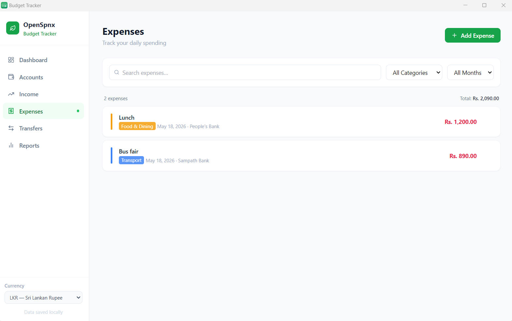
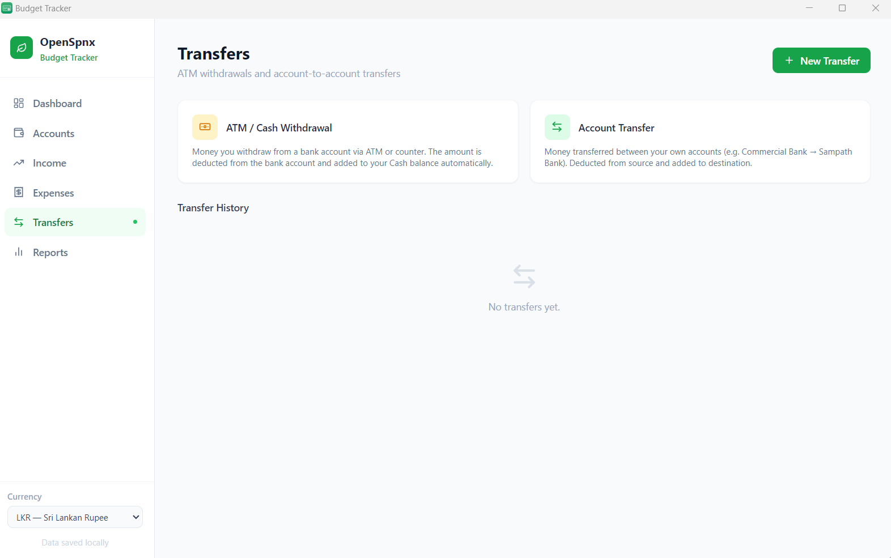
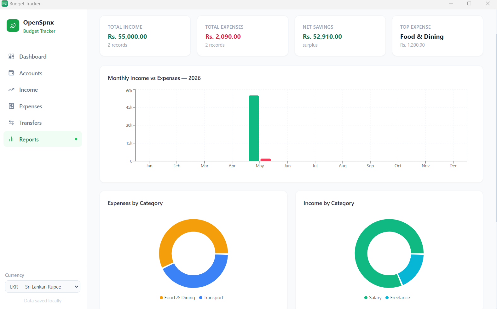

<div align="center">
  
  <h1>OpenSpnx</h1>
  <p><strong>Open-source personal finance tracker for Windows — accounts, income, expenses, transfers, and reports. 100% local data.</strong></p>

  <p>
    <a href="https://github.com/Madushan996/OpenSpnx/releases/latest">
      
    </a>
    
    
    
  </p>
</div>

---

## What is OpenSpnx?

OpenSpnx is a free, lightweight desktop budget tracker built for people who want full control of their finances — without sending data to the cloud. Everything is stored locally on your own computer.

No accounts. No subscriptions. No ads. Just a clean, fast app to manage your money.

---

## Screenshots

| Dashboard | Accounts |
|-----------|----------|
|  |  |

| Income | Expenses |
|--------|----------|
|  |  |

| Transfers | Reports |
|-----------|---------|
|  |  |

---

## Features

- **Multiple Accounts** — Track balances across bank accounts and cash separately
- **Income Tracking** — Log earnings by category (Salary, Freelance, Business, Investment, and more)
- **Expense Tracking** — Record daily spending with categories, dates, and descriptions
- **Transfers** — Log ATM withdrawals (bank → cash) and account-to-account transfers with automatic balance updates
- **Visual Reports** — Monthly income vs. expense bar charts, category pie charts, and daily activity area charts
- **33 Currencies** — Switch between LKR, USD, EUR, GBP, and 29 more currencies
- **100% Local Storage** — Your data never leaves your computer
- **No Login Required** — Open and use immediately

---

## Download

Download the latest Windows installer from the [**Releases**](https://github.com/Madushan996/OpenSpnx/releases/latest) page.

> **Requires:** Windows 10 or later (64-bit)

---

## Built With

| Technology | Purpose |
|------------|---------|
| [Electron](https://www.electronjs.org/) | Desktop app shell |
| [React 18](https://react.dev/) | UI framework |
| [Tailwind CSS](https://tailwindcss.com/) | Styling |
| [Recharts](https://recharts.org/) | Charts & graphs |
| [Vite](https://vitejs.dev/) | Build tool |

---

## Building from Source

**Prerequisites:** Node.js 18+ and npm

```bash
# Clone the repository
git clone https://github.com/Madushan996/OpenSpnx.git
cd OpenSpnx

# Install dependencies
npm install

# Run in development mode
npm run dev

# Build Windows installer
npm run electron:build
```

The installer will be output to the `release/` folder.

---

## Support the Project

OpenSpnx is completely free and open source. If you find it useful, consider supporting its development:

[](https://www.paypal.com/donate/?business=madushan7017@gmail.com&currency_code=USD)

Every donation, no matter the size, helps keep this project alive and growing. Thank you!

---

## Contributing

Contributions are welcome! Feel free to:

- Report bugs via [Issues](https://github.com/Madushan996/OpenSpnx/issues)
- Suggest new features via [Issues](https://github.com/Madushan996/OpenSpnx/issues)
- Submit a pull request with improvements

---

## License

This project is licensed under the **MIT License** — see the [LICENSE](LICENSE) file for details.

---

<div align="center">
  <sub>Made with ❤️ by <a href="https://github.com/Madushan996">Madushan996</a></sub>
</div>
